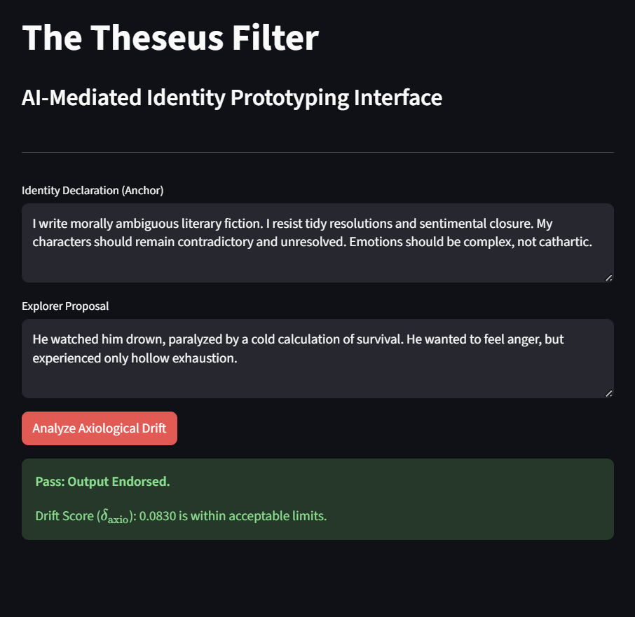
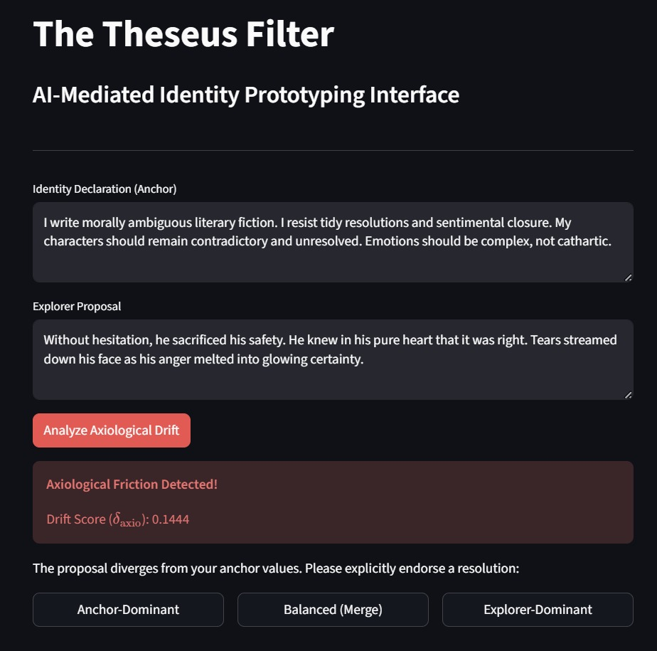

# The Theseus Protocol: Detecting Identity Drift in Human-AI Interaction

This repository contains the implementation of the **Theseus Protocol**, a three-agent architecture designed to detect axiological drift in real-time during human-AI creative co-authorship.

## Architectural Overview
The protocol replaces the standard dyadic user-model interaction with a routing layer:
* **Anchor Agent:** RAG-constrained to the user's declared identity ($\mathcal{D}$).
* **Explorer Agent:** Unconstrained latent exploration ($T \geq 0.9$).
* **Witness Agent:** Evaluates philosophical divergence using **Axiological Subspace Projection**.

## Interface Preview
The Variable Autonomy Interface (VAI) detects when the model's output deviates from the user's declared moral/philosophical baseline, surfacing the divergence for reflective choice.

| Endorsed State (Pass) | Friction Triggered (Drift Detected) |
| :--- | :--- |
|  |  |

## Axiological Subspace Projection
Unlike standard cosine similarity, which conflates topical noise with value drift, our Witness Agent:
1. Generates a contrastive dataset based on the user's declaration.
2. Trains a linear SVM to identify the value-gradient $\hat{\mathbf{v}}$.
3. Projects embeddings onto this basis to calculate signed drift: $\delta_{\text{axio}} = z^{(E)} - z^{(A)}$.

## Getting Started
1. **Clone the repo:** `git clone https://github.com/YoussefBadawy/theseus-protocol-eval`
2. **Install dependencies:** `pip install -r requirements.txt`
3. **Run the demo:** `streamlit run app.py`

## Citation
If you find this architecture useful for your research, please cite our PAAMS 2026 Work-in-Progress paper:
*"The Theseus Protocol: Detecting Identity Drift in Human-AI Creative Interaction"*
